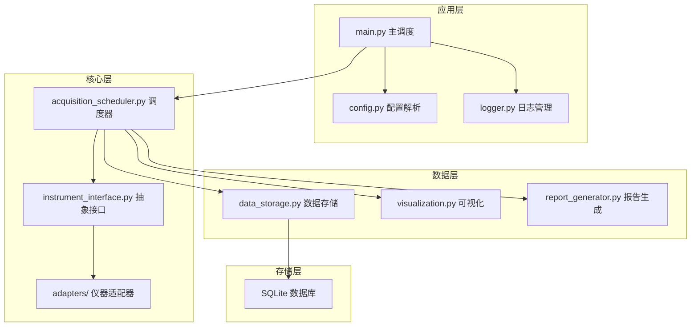
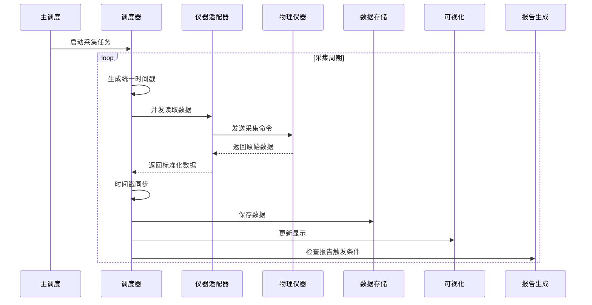
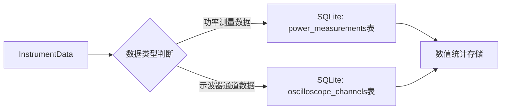

# 仪器数据采集系统 - 架构设计文档

## 1. 架构图

## 2. 模块划分

### 2.1 应用层
- **main.py**：主调度入口，负责加载配置、初始化模块、启动采集流程
- **config.py**：配置解析模块，负责加载和验证YAML配置文件
- **logger.py**：统一日志管理，支持控制台和文件日志

### 2.2 核心层
- **acquisition_scheduler.py**：并发调度器，负责多仪器并发采集、时间戳同步和回调分发
- **instrument_interface.py**：抽象接口层，定义InstrumentBase基类和数据容器
- **adapters/**：仪器适配器目录，包含：
  - **dlm5000_adapter.py**：DLM5000示波器适配器（SCPI/VISA）
  - **wt3000_adapter.py**：WT3000功率分析仪适配器（Socket）
  - **wt1804e_adapter.py**：WT1804E功率分析仪适配器（SCPI/VISA）

### 2.3 数据层
- **data_storage.py**：数据存储模块，负责将采集数值数据写入纯SQLite数据库
- **visualization.py**：可视化模块，负责数据的实时展示和图表生成
- **report_generator.py**：报告生成模块，负责基于模板生成自动报告

### 2.4 存储层
- **SQLite数据库**：存储所有数值统计数据，包括示波器通道统计值（Max/Min/Avg/RMS/P2P）和功率分析仪测量值（V/A/W/VAR/VA/PF/Wh/Hz），使用WAL模式保障数据安全

## 3. 接口定义

### 3.1 抽象接口（InstrumentBase）

| 方法名 | 入参 | 出参 | 描述 |
|--------|------|------|------|
| `connect()` | 无 | `bool` | 连接仪器，返回是否成功 |
| `disconnect()` | 无 | `bool` | 断开连接，返回是否成功 |
| `read_data()` | 无 | `InstrumentData` | 读取一次采集数据，返回标准化数据容器 |
| `configure(**params)` | `**params: Dict[str, Any]` | `bool` | 配置仪器参数，返回是否成功 |
| `get_status()` | 无 | `Dict[str, Any]` | 获取仪器当前状态 |

### 3.2 调度器接口（AcquisitionScheduler）

| 方法名 | 入参 | 出参 | 描述 |
|--------|------|------|------|
| `register_instrument(instrument: InstrumentBase)` | `instrument: InstrumentBase` | `bool` | 注册仪器到调度器 |
| `unregister_instrument(instrument_id: str)` | `instrument_id: str` | `bool` | 从调度器注销仪器 |
| `start()` | 无 | `bool` | 启动采集任务（参数通过构造函数设置） |
| `stop()` | 无 | `bool` | 停止采集任务 |
| `pause()` | 无 | `bool` | 暂停采集（保持仪器连接） |
| `resume()` | 无 | `bool` | 恢复采集 |
| `acquire_once()` | 无 | `AcquisitionResult` | 执行单次采集 |
| `add_callback(callback: Callable[[AcquisitionResult], None])` | `callback: Callable` | `bool` | 添加数据回调函数 |

### 3.3 数据存储接口（DataStorage）

| 方法名 | 入参 | 出参 | 描述 |
|--------|------|------|------|
| `save_acquisition(result: AcquisitionResult)` | `result: AcquisitionResult` | `bool` | 保存单次采集结果（含多台仪器数据）到SQLite |
| `save_acquisition_result(data: InstrumentData)` | `data: InstrumentData` | `bool` | 保存单台仪器的采集数据到SQLite |
| `query_records(instrument_id: str = None, start_time: float = None, end_time: float = None)` | `instrument_id: str` 仪器ID（可选） `start_time: float` 开始时间（可选） `end_time: float` 结束时间（可选） | `List[Dict]` | 查询指定条件的采集记录 |
| `query_power_data(instrument_id: str, start_time: float = None, end_time: float = None)` | `instrument_id: str` 仪器ID `start_time: float` 开始时间（可选） `end_time: float` 结束时间（可选） | `List[Dict]` | 查询功率分析仪测量数据 |
| `query_oscilloscope_data(instrument_id: str, start_time: float = None, end_time: float = None)` | `instrument_id: str` 仪器ID `start_time: float` 开始时间（可选） `end_time: float` 结束时间（可选） | `List[Dict]` | 查询示波器通道统计数据 |
| `get_record_count(instrument_id: str = None)` | `instrument_id: str` 仪器ID（可选） | `int` | 获取记录总数 |

## 4. 数据流向

### 4.1 采集数据流

### 4.2 数据存储流程

## 5. 异常处理策略

### 5.1 仪器通信异常
- **重试机制**：通信失败时自动重试3次，每次间隔1秒
- **错误日志**：记录详细的错误信息，包括错误类型、时间、仪器ID等
- **状态更新**：更新仪器连接状态，标记为断开
- **自动重连**：在后续采集周期中尝试自动重连

### 5.2 数据存储异常
- **本地缓存**：存储失败时将数据缓存到本地文件
- **延迟写入**：待存储服务恢复后，重新尝试写入
- **数据校验**：写入前对数据进行校验，确保数据完整性
- **错误告警**：存储连续失败时触发告警

### 5.3 系统异常
- **优雅退出**：捕获系统级异常，确保资源正确释放
- **状态保存**：定期保存系统状态，便于恢复
- **监控机制**：监控系统资源使用情况，避免过载
- **自动重启**：关键服务异常时尝试自动重启