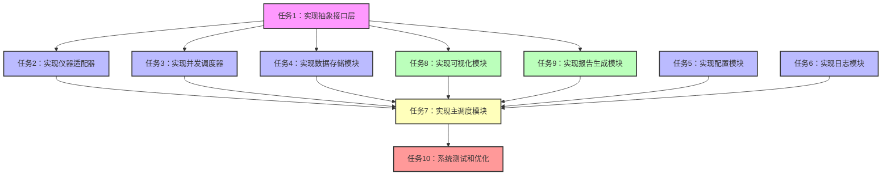

# 仪器数据采集系统 - 任务原子化文档

## 1. 原子任务清单

### 1.0 通信PoC验证（已完成）
- **输入**：无
- **输出**：PoC验证报告
- **实现约束**：
  - 验证与三台仪器的基本通信
  - 测试数据采集功能
  - 验证时间戳同步机制
- **验收标准**：
  - 所有仪器均能正常通信
  - 数据采集功能正常
  - 时间戳同步机制工作正常

### 1.1 核心模块开发

#### 任务1：实现抽象接口层（已完成）
- **输入**：无
- **输出**：`instrument_interface.py` 文件，包含 `InstrumentBase` 抽象基类和数据容器定义
- **实现约束**：
  - 零依赖设计，不使用任何外部库
  - 定义统一的接口方法和数据结构
  - 提供基础的状态管理功能
- **验收标准**：
  - 抽象基类定义完整，包含所有必需的抽象方法
  - 数据容器设计合理，支持波形和功率数据
  - 代码通过静态类型检查

#### 任务2：实现仪器适配器（已完成）
- **输入**：`instrument_interface.py`
- **输出**：
  - `adapters/dlm5000_adapter.py`：DLM5000示波器适配器
  - `adapters/wt3000_adapter.py`：WT3000功率分析仪适配器
  - `adapters/wt1804e_adapter.py`：WT1804E功率分析仪适配器
- **实现约束**：
  - 每个适配器独立实现，互不依赖
  - 正确处理通信协议（SCPI/Socket）
  - 实现所有抽象方法
- **验收标准**：
  - 适配器能够正确连接和通信
  - 能够正确读取和解析数据
  - 异常处理机制完善

#### 任务3：实现并发调度器（已完成）
- **输入**：`instrument_interface.py`
- **输出**：`acquisition_scheduler.py` 文件，包含 `AcquisitionScheduler` 类
- **实现约束**：
  - 支持同步和顺序两种采集模式
  - 实现时间戳同步机制
  - 支持回调分发（观察者模式）
- **验收标准**：
  - 能够并发采集多台仪器
  - 时间戳同步误差不超过50ms
  - 回调机制工作正常

### 1.2 数据存储模块

#### 任务4：实现数据存储模块
- **输入**：`instrument_interface.py`
- **输出**：`data_storage.py` 文件，包含 `DataStorage` 类
- **实现约束**：
  - 支持SQLite数据库存储数值统计数据（Max/Min/Avg/RMS/P2P等），不存储原始波形数据
  - 提供数据查询和检索功能
  - 使用SQLite WAL模式保障数据安全
- **验收标准**：
  - 数据存储和检索功能正常
  - 能够高效处理大量数值数据
  - 异常处理机制完善

#### 任务5：实现配置模块（已完成）
- **输入**：无
- **输出**：`config.py` 文件，包含配置解析功能
- **实现约束**：
  - 支持YAML配置文件解析
  - 提供类型校验和默认值
  - 支持运行时配置更新
- **验收标准**：
  - 配置文件解析正确
  - 类型校验功能正常
  - 配置更新机制工作正常

#### 任务6：实现日志模块（已完成）
- **输入**：无
- **输出**：`logger.py` 文件，包含日志管理功能
- **实现约束**：
  - 支持控制台和文件日志
  - 支持不同级别的日志
  - 日志格式统一规范
- **验收标准**：
  - 日志输出正常
  - 日志文件轮转功能正常
  - 日志级别控制有效

### 1.3 应用层和集成

#### 任务7：实现主调度模块（已完成）
- **输入**：所有核心模块
- **输出**：`main.py` 文件，包含主调度逻辑
- **实现约束**：
  - 支持命令行参数解析
  - 提供演示模式
  - 集成所有模块功能
- **验收标准**：
  - 命令行参数解析正确
  - 演示模式工作正常
  - 系统启动和运行稳定

#### 任务8：实现可视化模块（可选）
- **输入**：`instrument_interface.py`
- **输出**：`visualization.py` 文件，包含可视化功能
- **实现约束**：
  - 使用PySide6框架实现
  - 支持实时数据展示
  - 支持多种图表类型
  - 提供交互功能
- **验收标准**：
  - 数据可视化效果良好
  - 交互功能正常
  - 性能满足要求

#### 任务9：实现报告生成模块（已完成）
- **输入**：`instrument_interface.py`
- **输出**：`report_generator.py` 文件，包含报告生成功能
- **实现约束**：
  - 支持基于模板的Excel报告生成
  - 提供报告生成的触发机制
- **验收标准**：
  - 报告生成功能正常
  - 报告内容完整准确
  - 触发机制工作正常

#### 任务10：实现模板适配模块
- **输入**：`report_generator.py`
- **输出**：`templates/` 目录，包含Excel报告模板
- **实现约束**：
  - 设计合理的Excel模板结构
  - 支持数据动态填充
  - 提供模板配置选项
- **验收标准**：
  - 模板设计合理
  - 数据填充功能正常
  - 配置选项工作正常

#### 任务11：系统测试和优化
- **输入**：所有模块
- **输出**：测试报告和优化建议
- **实现约束**：
  - 进行功能测试和性能测试
  - 识别并解决性能瓶颈
  - 优化系统稳定性
- **验收标准**：
  - 所有功能测试通过
  - 性能满足要求
  - 系统稳定运行24小时以上

## 2. 任务依赖图

## 3. 任务优先级

### 高优先级（核心功能）
- 任务1：实现抽象接口层
- 任务2：实现仪器适配器
- 任务3：实现并发调度器
- 任务4：实现数据存储模块
- 任务5：实现配置模块
- 任务6：实现日志模块
- 任务7：实现主调度模块

### 中优先级（可选功能）
- 任务8：实现可视化模块
- 任务9：实现报告生成模块

### 低优先级（优化和测试）
- 任务10：系统测试和优化